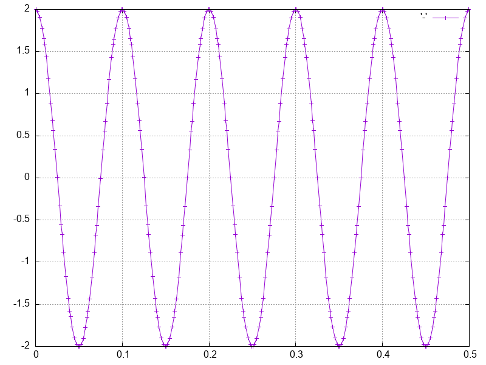

# Discontinuous Galerkin — 1D Akustik-Wellengleichung

[](LICENSE)

Ein 1D-Löser für die lineare **akustische Wellengleichung** mit der **Discontinuous-Galerkin-Methode** (DG) in C++. Eine von links einlaufende Sinuswelle breitet sich durch ein Rohr aus und wird an der starren rechten Wand reflektiert; das Ergebnis wird als PNG-Bildfolge geplottet und automatisch zu einem Video zusammengesetzt.



---

## Physikalisches Modell

Gelöst wird das lineare akustische System für Druck `p` und Schnelle `u`:

```
∂/∂t (p, u) + A ∂/∂x (p, u) = 0,     A = [[0, K], [1/ρ₀, 0]]
```

mit Kompressionsmodul `K = Z₀·c₀ = ρ₀·c₀²` und Impedanz `Z₀ = ρ₀·c₀`. Die Eigenwerte von `A` sind `±c₀` (rechts-/linkslaufende Wellen).

- **Diskretisierung:** nodale DG-Methode mit Gauß-Legendre-Knoten pro Zelle, Upwind-Fluss (charakteristische Aufspaltung `A = A⁺ + A⁻`).
- **Linker Rand:** einlaufende Sinuswelle (reine rechtslaufende Charakteristik, `freq_i = 3 kHz`).
- **Rechter Rand:** starre Wand (Reflexion, Druckverdopplung → Amplitude ±2 im eingeschwungenen Zustand).
- **Zeitintegration:** standardmäßig Prädiktor-Korrektor nach Heun (implizite Trapezregel via Fixpunktiteration); weitere Verfahren sind verfügbar (siehe Konfiguration).

---

## Projektstruktur

| Datei | Zweck |
|---|---|
| `src/main.cpp` | Aufbau (Anfangswerte, Massen-/Steifigkeitsmatrix), Zeitschleife, Orchestrierung |
| `config.yaml` | Alle Simulationsparameter (zur **Laufzeit** via yaml-cpp gelesen) |
| `src/ClassdXdt.{cpp,hpp}` | Räumlicher DG-Operator (rechte Seite der ODE, numerischer Fluss) + Zeitintegratoren |
| `src/InitialAndBoundary.{cpp,hpp}` | Anfangs- und Randbedingungen |
| `src/vandermonde.{cpp,hpp}` | Vandermonde- & Differentiationsmatrix (für die Steifigkeitsmatrix) |
| `src/ClassPlot.{cpp,hpp}` | Paralleles Plotten der Frames + Video-Erzeugung |
| `Makefile` | Build (für macOS / MacPorts konfiguriert) |

---

## Abhängigkeiten (macOS / MacPorts)

Das Projekt ist für **macOS mit MacPorts** und Apple `clang++` eingerichtet (BLAS/LAPACK über das **Accelerate**-Framework).

```sh
sudo port install armadillo
sudo port install gnuplot -qt5 -wxwidgets -aquaterm -pangocairo -luaterm   # nur PNG-Terminal nötig
sudo port install libomp                                                   # OpenMP
sudo port install yaml-cpp                                                 # Laufzeit-Config (config.yaml)
sudo port install ffmpeg                                                   # für die Video-Erzeugung
```

| Bibliothek | Verwendung | Hinweis |
|---|---|---|
| Armadillo | Lineare Algebra | nur Header (`-DARMA_DONT_USE_WRAPPER`) + Accelerate |
| gnuplot | Plotten (PNG) | wird zur Laufzeit als Prozess aufgerufen (Skript + `system()`) |
| yaml-cpp | Laufzeit-Config | parst `config.yaml`; gelinkt mit `-lyaml-cpp` |
| libomp | OpenMP (Zellschleife) | Apple clang braucht `-Xpreprocessor -fopenmp` |
| ffmpeg | Frames → `output.mp4` | |
| Accelerate | BLAS/LAPACK | macOS-Framework, kein extra Paket |

> **Andere Plattform / andere Versionen:** Die Pfade stehen oben im `Makefile` (`MACPORTS`, `OMPFLAGS`, `OMPLIBS`). Unter Linux Accelerate durch `-lopenblas -llapack` ersetzen.

---

## Bauen

```sh
make Release          # -> bin/Release/DiscontinousGalerkin
make clean            # Objektdateien, Binary, *.png, *.mp4, *.dat entfernen
```

Simulationsparameter (Ordnung, `N`, Zeitintegrator, Fluid/Gebiet) werden **nicht** mehr zur Compile-Zeit gesetzt, sondern zur Laufzeit aus `config.yaml` gelesen — dafür ist **kein** Neukompilieren nötig (siehe [Konfiguration](#konfiguration-configyaml)). Das einzige Compile-Zeit-Flag im `Makefile` ist:

| Variable | Default | Bedeutung |
|---|---|---|
| `DEBUGOROPTI` | `-O3` | Optimierungs-/Debug-Flags |

### Linux/arm64 via Docker testen

Der macOS-Build nutzt weiterhin Accelerate/MacPorts. Auf Linux schaltet der
`Makefile` automatisch auf `g++`, OpenBLAS/LAPACK, yaml-cpp und `-fopenmp` um.
Für einen schnellen ARM64-Smoke-Test gibt es ein Docker-Target:

```sh
# falls Colima verwendet wird:
colima start --arch aarch64

make docker-test-linux-arm64
```

Der Test baut ein `linux/arm64`-Image aus `Dockerfile.linux-arm64`, kompiliert
das Projekt in Ubuntu 24.04 und startet eine kleine Simulation mit
`tests/linux-smoke-config.yaml`. Dabei werden Config-Parsing, generische Ordnung
3, gnuplot-Frames und ffmpeg-Video-Encoding geprüft.

---

## Ausführen

Das Programm schreibt **pro Zeitschritt ein PNG** (`00000000.png`, …) ins aktuelle Verzeichnis, kodiert daraus automatisch `output.mp4` und wartet am Ende mit `cin.get()` auf Enter.

```sh
mkdir -p run && cd run
../bin/Release/DiscontinousGalerkin </dev/null   # findet config.yaml automatisch
```

Ohne Argument wird `config.yaml` zuerst im aktuellen Verzeichnis gesucht, sonst **neben der Binary** (Repo-Wurzel, zwei Ebenen über `bin/Release/`) — der `run/`-Workflow braucht daher kein Argument. Ein expliziter Pfad als erstes Argument hat Vorrang (z. B. `../bin/Release/DiscontinousGalerkin meine_config.yaml`). Das `</dev/null` überspringt den blockierenden „Press enter to exit"-Prompt. Mit der Default-Konfiguration entstehen ~12000 Frames; Gesamtlaufzeit ca. **36 s** (Simulation ~21 s, Plotten + Video ~15 s).

Das Video kann alternativ separat erzeugt werden (PNGs müssen im aktuellen Verzeichnis liegen):

```sh
make -C .. video        # ffmpeg %08d.png -> output.mp4
```

---

## Konfiguration (`config.yaml`)

Alle Parameter werden zur Laufzeit aus `config.yaml` gelesen — Änderungen wirken **ohne Neukompilieren**. Nur unabhängige Größen stehen in der Datei; abgeleitete (`Npoints`, `Z_0`, `omega`, `x`, `dx`, `Jac`) werden im Code berechnet.

| Parameter | Default | Bedeutung |
|---|---|---|
| `order` | `5` | Knotenordnung pro Zelle (funktional: 2, 5 und allgemein ≥ 3, z. B. 8) |
| `TimeIntegration` | `PredictorCorrectorHeun` | Zeitintegrationsverfahren |
| `N` | `50` | Anzahl Zellen |
| `x0, x1` | `0.0, 0.5` | Gebiet [m] |
| `t0, t1` | `0.0, 2e-2` | Zeitintervall [s] |
| `CFLReserve` | `0.45` | ordnungsunabhängige Sicherheitsfraktion des CFL-Limits |
| `c_0` | `300.0` | Schallgeschwindigkeit [m/s] |
| `rho_0` | `1.5` | Dichte [kg/m³] |
| `freq_i` | `3000.0` | Anregungsfrequenz [Hz] |
| `mu, sigma, height` | `0.1, 0.02, 1.0` | Parameter der (optionalen) Gauß-Anfangsverteilung |

Der **Zeitschritt** ist ordnungsabhängig (DG-CFL):

```
deltaT = CFLReserve · dx / (|c₀| · (2·order − 1))
```

Dadurch ist `CFLReserve` für alle Ordnungen gleich „sicher". Höhere Ordnung ⇒ kleinerer Zeitschritt ⇒ mehr Frames.

Verfügbare Werte für `TimeIntegration`: `EulerExplicit`, `RungeKuttaClassic`, `RungeKuttaSecond`, `RungeKuttaSecondOrder`, `PredictorCorrectorHeun`.

---

## Performance & Parallelisierung

- **`-O3`** statt `-O0`: ~2,3× auf die Simulation.
- **Block-weiser Volumenterm:** Statt der dichten Matrix `A = kron(eye(N), Q)` wird `Q` zellweise angewandt (`vectorise(Q * reshape(X, 2·order, N))`) — ~N× weniger Arbeit; als GEMM, das Accelerate bei großem N über Kerne parallelisiert.
- **Paralleles Plotten** (`ClassPlot`, `std::thread`): Jeder Thread baut ein gnuplot-Skript für seinen Frame-Anteil; alle Skripte werden aus *einer* Shell gestartet (`gnuplot … & … ; wait`). Vermeidet den macOS-`popen`/`fork`-Deadlock bei vielen Threads. → Plotten ~42 s ⇒ ~6 s pro 3000 Frames.
- **OpenMP-Zellschleife** in `FluidMatrix`, aktiviert ab `N ≥ 1024`. Bei kleinem N (z. B. Default N=50) bleibt sie seriell, weil der Thread-Overhead die winzige Arbeit überwiegen würde; bei N=2048 bringt sie ~1,6×.

---

## Hinweise / Bekanntes

- Der Projektname enthält den Tippfehler „Discontinous" (statt „Discontinuous"); das Binary heißt entsprechend `DiscontinousGalerkin`.
- Ordnung 2, 5 und beliebige Ordnung ≥ 3 (Gauß-Legendre-Knoten/-Gewichte werden via Golub-Welsch berechnet) funktionieren; Ordnung 8 ist verifiziert. Ordnung 1 ist im Setup unvollständig.
- HDF5 ist installiert, wird aber **nicht** gelinkt (alle HDF5-Aufrufe im Code sind auskommentiert).
- Frames im Frame-Index, der ein Vielfaches der Anregungsperiode ist, treffen den zeitlichen Nulldurchgang der stehenden Welle und wirken daher flach — das ist korrektes Verhalten, kein Fehler.

---

## Lizenz

Dieses Projekt steht unter der **GNU General Public License v3.0** — siehe [`LICENSE`](LICENSE).
